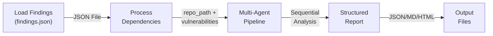
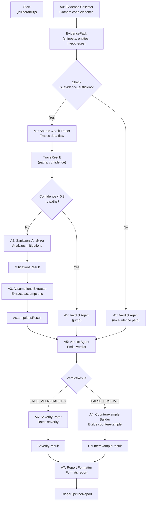
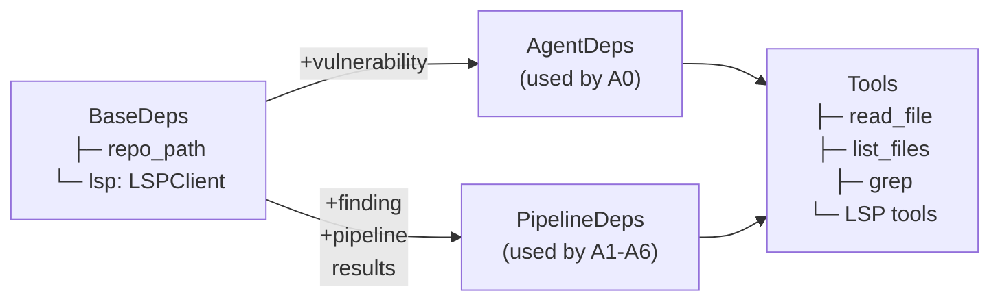

# Triage — AI-Assisted Vulnerability Validation

A CLI tool to validate SAST findings in Python projects using an AI agent. Classifies each finding as True Positive or False Positive, and generates a detailed JSON report with justification.

## Requirements

- Python >= 3.14
- [uv](https://github.com/astral-sh/uv) (or pip)
- Environment variable `OPENAI_API_KEY` for the AI model

## Environment Setup

Create a `.env` file in the project root with your API key:

```bash
OPENAI_API_KEY=sk-...
```

If you use [direnv](https://direnv.net/), the `.envrc` will automatically load the `.env` file when you enter the directory.

## Installation

### Using Nix (Recommended)

[Nix](https://nixos.org/download/) is a declarative package manager that ensures reproducible builds across all machines.

**Install Nix:**

> **Note:** Nix flakes and the `nix` command are **disabled by default** in a standard Nix installation. The recommended way to install Nix is via the [Determinate Systems installer](https://github.com/DeterminateSystems/nix-installer), which enables flakes and the unified `nix` CLI out of the box:

```bash
curl -fsSL https://install.determinate.systems/nix | sh -s -- install
```

Alternatively, visit https://nixos.org/download/ for the official installer (you will need to enable flakes manually).

**Enter the development environment:**

```bash
nix flake update  # Update flake inputs (optional)
nix develop       # Enter Nix dev environment with all dependencies
```

Inside the Nix environment, all Python packages and tools are automatically available:

```bash
# Inside nix develop
uv sync           # Install project dependencies
uv run triage --help
```

**Single command execution (without entering shell):**

```bash
nix develop -c uv sync
nix develop -c uv run triage run-pipeline --repo-path /path/to/repo --findings-path findings.json
```

**Linting:**

```bash
nix run .#lint    # Run linters (ruff + mypy) via Nix
```

### Using uv + pip

```bash
uv sync
```

## Usage

### Running the Triage Pipeline

```bash
uv run triage run-pipeline \
  --repo-path /path/to/repo \
  --findings-path /path/to/findings.json \
  -o report
```

**Options:**

- `--repo-path`: Repository directory to analyze (source code)
- `--findings-path`: JSON file with the list of findings
- `-o`, `--output`: Output report prefix (generates JSON, Markdown, and HTML; default: `report`)

**Example:**

```bash
uv run triage run-pipeline \
  --repo-path samples/sample1 \
  --findings-path samples/sample1/findings.json \
  -o my_report
```

Generates: `my_report.json`, `my_report.md`, `my_report.html`

### Converting an Existing Report

```bash
uv run triage convert-report \
  --input report.json \
  -o report
```

Converts a report JSON to Markdown and HTML formats.

## Architecture

### General Flow



### Multi-Agent Pipeline (A0–A7)

The heart of the system is a sequential pipeline of specialized agents based on Pydantic AI. Each vulnerability is classified as either **TRUE_VULNERABILITY** or **FALSE_POSITIVE** through the following stages:



### Dependency Injection



### Tools and Components

**Framework & CLI:**
- **CLI**: Click (Python) — `run-pipeline` and `convert-report` commands
- **AI Agent**: Pydantic AI (orchestrator in `src/triage/agent/orchestrator.py`)
- **Concurrency**: AsyncIO with semaphore (default concurrency: 5)

**AI Model:**
- **Provider**: OpenAI
- **Default Model**: `gpt-5-mini` (configurable)
- **Required Environment**: `OPENAI_API_KEY`

**Agent Tools:**
- `read_file` / `read_file_lines` — read files from the repository
- `list_files` — list files with ripgrep and tree output
- `grep` — async ripgrep-based pattern search
- **LSP tools** (optional) — go_to_definition, find_references, hover, document_symbol
  - Uses Pyright via `lsp-client` for advanced analysis

**Validation:**
- `tree-sitter` + `tree-sitter-python` — AST analysis for function location

**Note**: MCP tools are not used in this version; agents operate directly on the local repository with path control (`resolve_repo_path()` prevents directory traversal attacks).

## Project Structure

```
src/triage/
├── models/              # Pydantic data models
│   ├── vulnerability.py # Vulnerability (input finding)
│   ├── findings.py      # FindingsFile (JSON loader)
│   └── pipeline.py      # Pipeline output types (Evidence, Trace, Mitigations, etc.)
├── agent/
│   ├── orchestrator.py  # Multi-agent pipeline orchestrator
│   ├── deps.py          # Dependency injection (BaseDeps, AgentDeps, PipelineDeps)
│   ├── prompts.py       # System prompts for each agent
│   ├── agents/          # Factory functions for A0–A7
│   └── tools/           # Tools (read_file, list_files, grep, LSP)
├── cli/                 # Click commands (run-pipeline, convert-report)
├── report/              # Report generation
│   ├── json_report.py   # Structured JSON output
│   ├── markdown_report.py# Markdown output
│   ├── html_report.py   # HTML output
│   └── enricher.py      # Optional enrichment with A7
└── utils/
    └── tree.py          # Tree-sitter utilities for AST
```

## Development

### Tests

```bash
uv run pytest tests/unit -v                          # Run all tests
uv run pytest tests/unit/test_models.py -v          # Run specific test
```

### Code Quality

```bash
uv run mypy src/                                     # Type checking
uv run ruff check src/                               # Linting
```

### Dependency Management

```bash
uv sync                                              # Install/update dependencies
```
